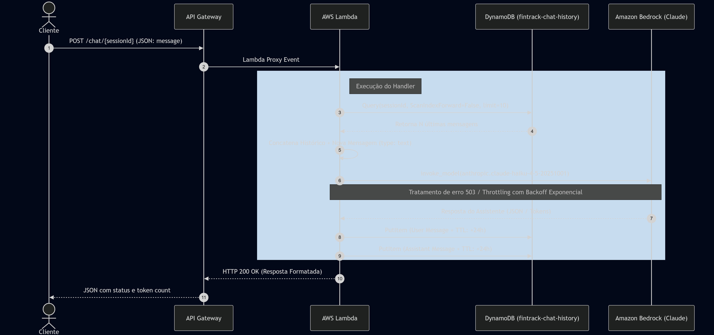
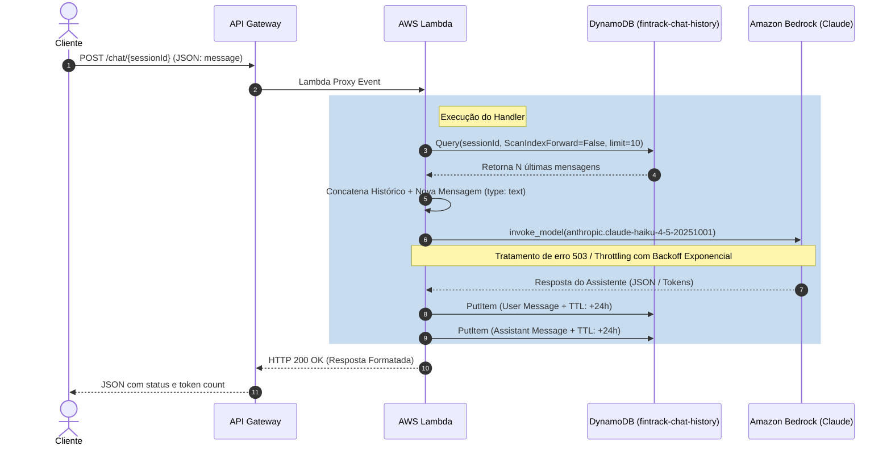

# FinTrack AI Insights - Documentação do Código (Bloco 2)

Este repositório contém o código-fonte (Python) e a infraestrutura como código (Terraform) para o microserviço de assistência financeira.

## 📌 Pré-requisitos

Para rodar este projeto ou executá-lo localmente, você precisa ter instalado:
- **Python 3.10+** (recomendado `3.12` para parear com a AWS Lambda)
- **Terraform >= 1.0**
- **AWS CLI** devidamente configurado (`aws configure`).

## 🛠 Setup Local

Para rodar o código de forma isolada do ambiente em nuvem e gerenciar suas credenciais com segurança, recomendamos o uso do `aws-vault` ou `localstack`.

### Usando o `aws-vault` (Recomendado)
O `aws-vault` armazena com segurança chaves IAM no keystore do seu sistema e expõe credenciais temporárias para o ambiente do terminal.

1. Instale o aws-vault (ex: `brew install aws-vault` ou faça o download do binário).
2. Adicione seu perfil:
```bash
aws-vault add fintrack-dev
# Insira sua Access Key e Secret Key da AWS
```
3. Execute comandos injetando o contexto de autenticação:
```bash
aws-vault exec fintrack-dev -- pytest tests/
```

### Configurando Virtual Environment (Python)

Antes de rodar os testes, isole as dependências:
```bash
python3 -m venv .venv
source .venv/bin/activate
pip install -r src/requirements.txt
pip install pytest pytest-mock
```

## 🧪 Como Rodar os Testes

A suíte de testes utiliza o `pytest` aliado à biblioteca `unittest.mock` para simular o comportamento do DynamoDB e do Amazon Bedrock, garantindo a validação de retornos, status HTTP 503 para quedas (Throttling) e montagem de payload sem cobrança indevida em serviços reais.

Rode o comando na raiz do projeto:
```bash
pytest tests/ -v
```

## 🚀 Como Fazer o Deploy

O deploy é gerido de ponta-a-ponta pelo Terraform, que empacota automaticamente o diretório `src/` em um `.zip` e realiza o provisionamento da Lambda, Roles, API Gateway e Tabela DynamoDB.

1. Navegue para o diretório de infraestrutura:
```bash
cd terraform
```
2. Baixe os provedores e inicialize os arquivos de lock:
```bash
terraform init
```
3. Inspecione a infraestrutura e veja quais recursos serão adicionados:
```bash
terraform plan
```
4. Suba para o ambiente de Nuvem AWS:
```bash
terraform apply
```
*Responda `yes` quando o terminal pedir confirmação.*

---

## 📊 Diagrama de Sequência (Fluxo Principal)

O fluxo abaixo representa o caminho que uma mensagem do usuário trilha ao usar a funcionalidade de chat via API.




